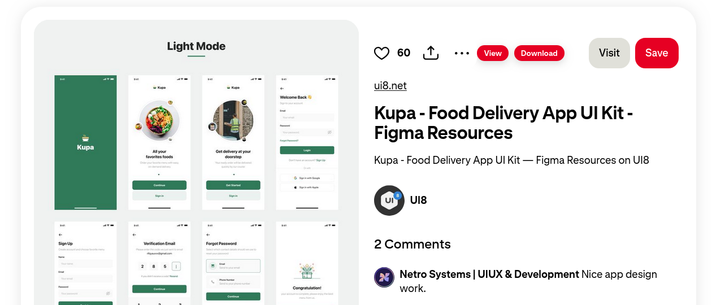
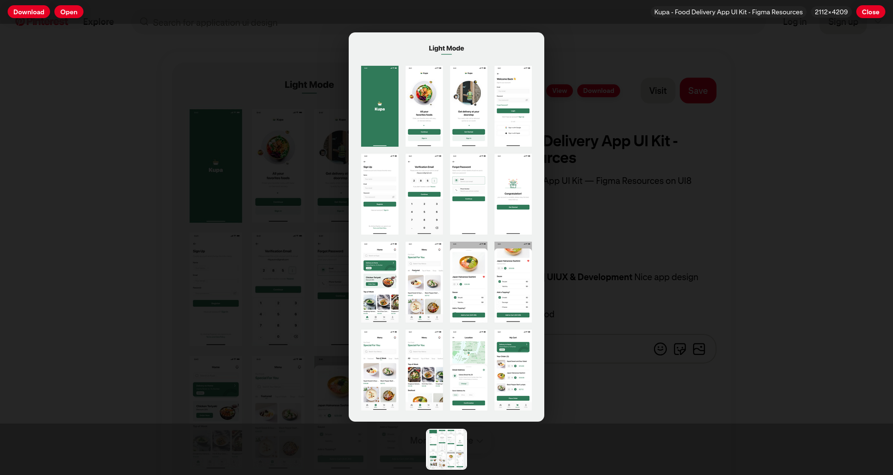

# Pinterest Full

> A lightweight userscript that lets you **download original quality images and videos from Pinterest without logging in**. Adds View and Download buttons with a beautiful gallery interface.

## Table of Contents

- [Features](#features)
- [Quick Install](#quick-install)
- [Supported Formats](#supported-formats)
- [Screenshots](#screenshots)
- [Contributing](#contributing)
- [License](#license)
- [Acknowledgements](#acknowledgements)

## Features

- **No Login Required** - Download original content without Pinterest account
- **Original Quality** - Get full-size images and videos, not compressed versions
- **View Button** - Opens images/videos in a full-screen gallery
- **Download Button** - Downloads original quality content
- **Gallery Navigation** - Browse multiple images with thumbnails
- **Mobile Optimized** - Touch gestures and responsive design

## Quick Install

1. Install any userscript manager:
   - **[Violentmonkey](https://violentmonkey.github.io/) (Recommended)**
   - [Tampermonkey](https://www.tampermonkey.net/)
   - [ScriptCat](https://scriptcat.org/)
2. [Click here to install](https://github.com/ShrekBytes/pinterest-full/raw/main/pinterest-full.user.js)
3. Visit any Pinterest pin page
4. Look for the **View** and **Download** buttons!

## Supported Formats

- **Images**: JPG, PNG, GIF, WebP
- **Videos**: MP4, WebM
- **Story Pins**: Multi-page content

## Screenshots

  
  

## Contributing

Found a bug? Want a feature? [Open an issue](https://github.com/ShrekBytes/pinterest-full/issues) or submit a pull request!

## License

GPL-3.0 - See [LICENSE](LICENSE) file.

## Acknowledgements

This script is based on the excellent work of **TiLied**'s [Pinterest Plus](https://greasyfork.org/en/scripts/30839-pinterest-plus) script.

---

**Made with ❤️ by [ShrekBytes](https://github.com/ShrekBytes)**
